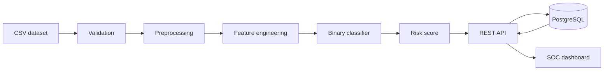

# Architecture

Status: proposed foundation for review; no application components exist yet. The user-specified invariants below govern future implementation.

## Scope and invariants

AegisSOC supports investigation with reproducible detections and structured evidence. An **Event** is raw or normalized telemetry; an **Alert** is a detection from one or more events; an **Incident** is a correlated security case containing related alerts/events. See [the schema](event-schema.md) and [ADR 001](decisions/001-event-alert-incident-model.md).

LLMs never act as the primary threat detector, set authoritative labels, or authorize responses. Detection uses rules, statistical methods, or evaluated models. AI explanations consume selected structured evidence, cite its identifiers, and disclose missing context. Telemetry is always untrusted. Analyst approval is required by default before automated response actions.

## Phase 1: one modular application

The diagram describes data movement, not separate services. Use Python, FastAPI, Pydantic, and SQLAlchemy in a modular backend; NumPy and scikit-learn plus Pandas or Polars for batch processing; PostgreSQL for persisted records; React, TypeScript, and Vite for the dashboard; Docker and Docker Compose for a later local environment.

Proposed internal boundaries:

| Module | Responsibility |
| --- | --- |
| Ingestion/normalization | Validate CSV, retain provenance, produce typed Events, quarantine invalid rows |
| Features/training | Version feature definitions, split data safely, fit and evaluate artifacts offline |
| Detection | Run approved inference artifacts; persist a detection result for each scored Event and create Alerts only when policy warrants |
| Risk | Compute Threat Severity and Evidence Confidence with separate explanations |
| Persistence/API | Store and retrieve evidence, results, Alerts, and audit records with access controls |
| Dashboard | Display Event evidence, detections, severity, confidence, and model limitations |

Phase 1 trains `0 = BENIGN`, `1 = MALICIOUS`: Logistic Regression baseline, then Random Forest comparison. XGBoost/LightGBM requires measured justification. Training is a batch operation outside request handling; serving loads a validated artifact. The Incident entity and relationships are specified now; automatic correlation, full case management, LLM integration, and response execution remain later work. No broker, graph database, search cluster, model registry service, or microservices are needed initially.

## Long-term capability map

| Stage | Intended capabilities | Boundary preserved in Phase 1 |
| --- | --- | --- |
| Collection | Telemetry ingestion, streaming telemetry, Zeek/Suricata sources | Source adapters and versioned Event envelope |
| Preparation | Normalization, feature engineering, threat intelligence enrichment | Explicit transforms, provenance, missing-value semantics |
| Detection | Rule-based detection, supervised ML, anomaly detection, UEBA | Versioned detection result; detector-specific score semantics |
| Reasoning | Event correlation, MITRE ATT&CK mapping, attack graphs | Links among evidence, detections, and cases; mappings require evidence |
| Assessment | Risk scoring, evidence confidence, explainable AI | Separate versioned assessments with cited inputs |
| Operations | Analyst investigation, approved response, model monitoring | Audit trail, authorization, feedback, and artifact identity |

Future candidates include Kafka for transport, Redis for short-lived state, OpenSearch for search, Neo4j for graph analysis, MLflow for experiment/artifact management, and SHAP for feature attribution. An ADR and measured need must precede adoption. UEBA requires appropriate identity context, privacy controls, and evaluation; a binary flow classifier does not establish these capabilities.

## Batch to streaming

Keep normalization, feature transforms, detection, and risk functions independent of CSV iteration and HTTP. They accept versioned records and return explicit outputs; adapters manage transport and persistence. Record event time separately from ingestion time, source identity, schema/feature versions, and stable idempotency keys.

Batch jobs use bounded chunks and explicit job state. Future stream consumers must handle replay, duplicates, late/out-of-order events, windowed state, backpressure, and retries without duplicating Alerts. Use idempotent writes and persisted processing checkpoints; do not assume exactly-once delivery. Future online features must use only information available as of the event time. Implement streaming machinery only when the scope requires it.

## Changes and review

Every major architectural change requires an ADR in [decisions/](decisions/): context, decision, alternatives, consequences, status, and validation plan. In particular, review changes to entities, trust boundaries, feature semantics, risk policies, external AI sharing, deployment topology, and dependencies. [The threat model](threat-model.md), [ML pipeline](ml-pipeline.md), [API contracts](api-contracts.md), and [deployment plan](deployment.md) constrain implementation.
